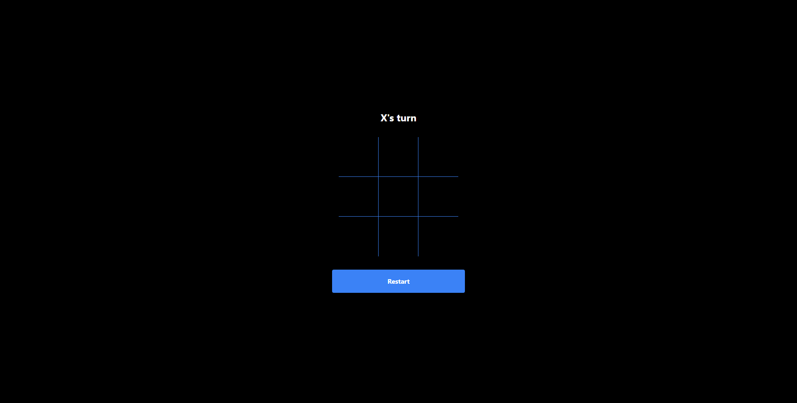

<h1 align="center">Tic tac toe</h1>
<p align="center">
  
  <a href="https://www.linkedin.com/in/fellipeutaka/">
    
  </a>
  <a href="https://github.com/fellipeutaka/tic-tac-toe/commits/main">
    
  </a>
  
  <a href="https://github.com/fellipeutaka/tic-tac-toe/stargazers">
    
  </a>
</p>

<p align="center">
  <a href="#-project">Project</a> |
  <a href="#-technologies">Technologies</a> |
  <a href="#ℹ%EF%B8%8F-how-to-use">How to use</a> |
  <a href="#-how-to-contribute">How to contribute</a> |
  <a href="#-license">License</a> |
  <a href="https://tictactoe-fellipeutaka.vercel.app/">Live demo</a>
</p>

## 💻 Project

A offline tic-tac-toe game made with React and TailwindCSS.

<h1 align="center">
  
</h1>

## 🚀 Technologies

This project was developed with the following technologies:

- [TypeScript][ts]
- [React][react]
- [Vite][vite]
- [Vitest][vitest]
- [Tailwind][tailwindcss]

## ℹ️ How To Use

To clone and run this application, you will need [Git][git] and [Node.js][node] installed on your computer.

From your command line:

```bash
# Clone this repository
$ git clone https://github.com/fellipeutaka/tic-tac-toe.git

# Install dependencies
# If you are using NPM
$ npm install

# If you are using Yarn
$ yarn install

# If you are using PNPM (current package manager)
$ pnpm install

# Start server
# If you are using NPM
$ npm run dev

# If you are using Yarn
$ yarn dev

# If you are using PNPM (current package manager)
$ pnpm dev
```

## 🤔 How to contribute

1. Fork this repository.
2. Create a branch: `git checkout -b <branch_name> `.
3. Make your changes and commit them: `git commit -m '<commit_message> '`
4. Push to original branch:`git push origin <project_name> / <local>`
5. Create the pull request. Or, see the GitHub documentation on [how to create a pull request][pr].

## 📝 License

This project is under the MIT license. See the [LICENSE](https://github.com/fellipeutaka/tic-tac-toe/blob/main/LICENSE.md) for details.

Made with ♥ by Fellipe Utaka 👋 [Get in touch!](https://www.linkedin.com/in/fellipeutaka/)

[pr]: https://help.github.com/en/github/collaborating-with-issues-and-pull-requests/creating-a-pull-request
[git]: https://git-scm.com
[node]: https://nodejs.org/
[ts]: https://www.typescriptlang.org/
[react]: https://reactjs.org
[vite]: https://vitejs.dev/
[vitest]: https://vitest.dev/
[tailwindcss]: https://tailwindcss.com/
